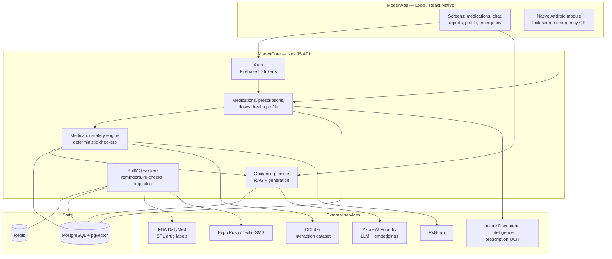
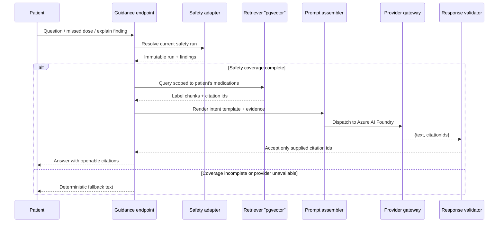

# Moeen — AI Medication Companion

Moeen (**مُعين**) is a medication companion for patients who juggle several prescriptions at
once. It keeps track of what a person takes and when, warns them when two of their medicines
interact or clash with an allergy or a chronic condition, and answers their questions about
their own medications with guidance grounded in official drug labels — with citations, never
free-form invention.

The project was built during an AI engineering internship at **ASAL Technologies** and is split
into two applications:

| Folder | What it is |
| --- | --- |
| [`MoeenCore/`](MoeenCore) | NestJS + TypeScript backend: REST API, medication-safety engine, RAG guidance pipeline, background jobs |
| [`MoeenApp/`](MoeenApp) | React Native (Expo) Android app: the patient-facing client |

---

## Table of contents

- [Features](#features)
- [Architecture](#architecture)
- [How guidance is produced](#how-guidance-is-produced)
- [Tech stack](#tech-stack)
- [Repository layout](#repository-layout)
- [Getting started](#getting-started)
- [Testing](#testing)
- [Data sources](#data-sources)
- [Security and privacy](#security-and-privacy)
- [Status](#status)
- [Team](#team)

---

## Features

**Medication tracking**

- Add medications by searching a catalog built from the Palestinian medicines registry, or
  scan a paper prescription and confirm the extracted draft before saving it.
- Per-medication dose schedules, dose logging, archiving, and weekly adherence reports.
- Push reminders when a dose is due, with SMS as a fallback channel and per-user
  notification preferences.

**Safety**

- A deterministic safety engine checks every active medication for drug–drug interactions,
  drug–allergy conflicts, and drug–condition conflicts.
- Any change to the patient's context — a new medication, a new allergy, a new condition —
  re-runs the affected checks automatically through a transactional outbox, so warnings are
  never stale.
- Safety findings are stored as immutable runs with their own evidence, and the AI layer
  reads them; it can never overrule or reinterpret them.

**AI guidance**

- A chat assistant that answers medication questions, explains a safety finding, or advises
  on a missed dose.
- Every answer is built from retrieved passages of the FDA DailyMed label for the patient's
  *own* medications, and every claim carries a citation the user can open.
- If retrieval coverage is incomplete or the model provider is unavailable, the system falls
  back to deterministic, pre-written text instead of guessing.

**Emergency access**

- An emergency medical card — medications, allergies, conditions — reachable by a first
  responder through a QR code on the phone's lock screen, backed by a custom native Android
  Expo module.
- The QR opens a public `/e` responder page that holds the credential in memory only and
  sends it exclusively in an `Authorization` header; the token is never put in a URL,
  rendered, logged, or written to browser storage.

---

## Architecture



### Design rules the codebase enforces

- **Safety is the authority.** The checkers decide what is unsafe. Guidance consumes the
  persisted result; it does not re-run, re-rank, or soften it.
- **One exit to the model.** `guidance/generation/provider-gateway` is the only place in the
  codebase allowed to call a model provider — an architecture test fails the build if any
  other file so much as names the provider token.
- **Degrade, never fabricate.** Provider timeouts, outages, refusals, rate limits, and open
  circuits all resolve to a typed `fallback_required` signal that renders deterministic text.
  The single exception that throws is a redaction failure: an outage may degrade, a privacy
  failure must stop.
- **Evidence is scoped in SQL.** A patient can only ever retrieve label chunks for
  medications they actually take — enforced in the `WHERE` clause, before any row reaches
  JavaScript, not by filtering afterwards.

---

## How guidance is produced



Retrieval detail worth knowing: every stored vector records the embedding model and version
that produced it, and a query only matches chunks from the same profile — so vectors from
different embedding spaces are never compared as if they were compatible. When the active
profile changes, a startup reconciler re-embeds affected labels from persisted raw SPL rather
than re-fetching DailyMed.

---

## Tech stack

**Backend**

- NestJS 11, TypeScript, Node.js
- PostgreSQL 17 with `pgvector`, Drizzle ORM and Drizzle Kit migrations
- BullMQ + Redis for background jobs, with a Bull Board dashboard
- Azure AI Foundry (chat + embeddings), Azure Document Intelligence (OCR)
- Firebase Admin for authentication, Expo Server SDK for push, Twilio for SMS
- Swagger, Helmet, class-validator, Luxon, Docker Compose
- Jest for unit and e2e tests

**Mobile**

- React Native + Expo (Expo Router, file-based routing), TypeScript
- Expo Notifications, Secure Store, Image Picker, Print, Task Manager
- A custom native Android Expo module (Kotlin) for the emergency lock-screen notification
- Firebase Auth, `react-native-qrcode-svg`, Reanimated

---

## Repository layout

```
Moeen/
├─ MoeenCore/
│  ├─ moeen/
│  │  ├─ src/
│  │  │  ├─ auth/                 Firebase token verification, guards
│  │  │  ├─ users/                Accounts and onboarding
│  │  │  ├─ health-profile/       Allergies, chronic conditions, personal info
│  │  │  ├─ medications/          Search, add, update, archive, doses, warnings
│  │  │  ├─ prescriptions/        OCR scan, draft mapping, confirmation
│  │  │  ├─ medication-events/    Dose logging
│  │  │  ├─ medication-safety/    Checkers, RxNorm, DDInter, runs, re-check queue
│  │  │  ├─ knowledge/            DailyMed label ingestion and chunking
│  │  │  ├─ guidance/             Context, generation, endpoints, audit
│  │  │  ├─ notifications/        Push and SMS adapters, dose queue, preferences
│  │  │  ├─ emergency-support/    Emergency card, contacts, public endpoint
│  │  │  └─ database/schema/      Drizzle schema
│  │  └─ drizzle/                 Generated migrations
│  ├─ research/                   Palestine medication coverage dataset
│  └─ docker-compose.yml          Local PostgreSQL
└─ MoeenApp/
   ├─ src/app/                    Expo Router routes, incl. the public /e page
   ├─ src/features/               chat, medications, prescription-scan, reports,
   │                              schedule, emergency-support, notifications
   ├─ src/components/             Themed UI primitives
   └─ modules/                    Native Android emergency lock-screen module
```

Several folders carry their own `README.md` or `ARCHITECTURE.md` describing local invariants —
`medication-safety/`, `guidance/context/retriever/`, `guidance/generation/provider-gateway/`,
and the prompt templates are all documented in place.

---

## Getting started

Full instructions live in the two sub-READMEs:

- Backend: [`MoeenCore/README.md`](MoeenCore/README.md)
- Mobile app: [`MoeenApp/README.md`](MoeenApp/README.md)

The short version:

```bash
# 1. Backend — PostgreSQL via Docker, then the API
cd MoeenCore
cp .env.example .env
docker compose up -d --build          # postgres:17 on :5432

cd moeen
cp .env.example .env
npm install
npx drizzle-kit generate && npx drizzle-kit migrate
npm run start:dev                     # http://localhost:3000
```

```bash
# 2. Mobile app — Android development build
cd MoeenApp
npm install
npx expo run:android
```

**No cloud account needed to start.** `GENERATION_PROVIDER` defaults to `stub`, so a fresh
checkout runs the whole guidance pipeline with no Foundry key, no network calls, and no cost.
The stub answers through the same port as the real adapter and returns the same
`{ text, citationIds }` envelope, so local output still passes the response validator.
Switching to the real provider is three environment variables:

```env
GENERATION_PROVIDER=foundry
FOUNDRY_ENDPOINT=https://<resource>.services.ai.azure.com
FOUNDRY_API_KEY=<key>
```

Swagger (`SWAGGER_ENABLED=true`) and the queue dashboard (`QUEUE_DASHBOARD_ENABLED=true`, plus
credentials) are disabled by default.

---

## Testing

```bash
# Backend
cd MoeenCore/moeen
npm run test          # unit
npm run test:e2e      # end-to-end
npm run test:cov      # coverage

# Mobile app
cd MoeenApp
npm run test:chat
npm run test:reports
npm run test:emergency-access
npm run test:prescription-confirm
```

---

## Data sources

| Source | Used for |
| --- | --- |
| FDA DailyMed (SPL) | Drug label text, chunked and embedded as the evidence base for guidance |
| DDInter | Drug–drug interaction severities |
| RxNorm | Ingredient normalisation across brand and generic names |
| Palestine MoH registered products | Medication catalog for search — 2,510 human drug products |
| Palestinian Essential Medicines List 2022 | Catalog coverage reference |

The research datasets and how they were acquired are documented in
[`MoeenCore/research/palestine-medication-coverage/`](MoeenCore/research/palestine-medication-coverage).

---

## Security and privacy

- Patient context sent to a model provider is minimised and redacted first; a redaction
  failure aborts the request rather than degrading it.
- Emergency credentials travel only in an `Authorization: Bearer` header. Raw tokens and
  emergency-card responses must never be logged, and reverse proxies, access logs, and APM
  must redact the header.
- The public emergency route allows exactly one configured origin, does not enable
  credentialed CORS, and refuses to start on invalid origin configuration.
- `TRUST_PROXY_HOPS` defaults to `0`, so untrusted `X-Forwarded-For` headers cannot spoof
  `request.ip`. Invalid values stop startup.
- Guidance calls are rate-limited per patient and written to an audit table.

---

## Status

Moeen is an internship project, not a registered medical device, and it does not replace a
pharmacist or a physician. Some user stories are deliberately unfinished — emergency contacts,
for instance, are returned empty by the public card endpoint until the Manage Emergency
Contacts story extends the contract — and the public endpoint's rate limiter is process-local,
so a multi-instance deployment would need a shared limiter.

---

## Team

Built at **ASAL Technologies**, Rawabi.

- **Mentors:** [Hamad Mohsen](https://www.linkedin.com/in/hamadmohsen/), [Bara Musleh](https://www.linkedin.com/in/bara-musleh-7b2125217/)
- **Team:** Alaa Faraj, Islam Saad Aldeen, Mohammad Ismael, Salam Bitar, Ahmad Suleiman, Iyana Abubaker
